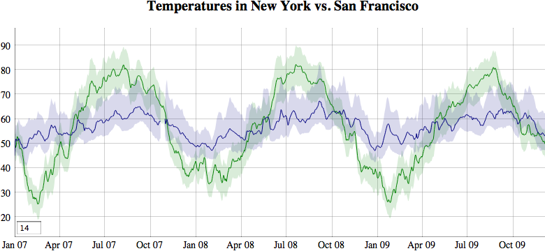

# dygraphs JavaScript charting library

The dygraphs JavaScript library produces interactive, zoomable charts of time series:



Learn more about it at [dygraphs.com](https://dygraphs.com/).

Get help with dygraphs on [Stack Overflow][] (preferred) and [Google Groups][].

## Features
* Plots time series without using an external server or Flash
* Supports [error bands][] around data series
* Interactive [pan and zoom][]
* Displays values [on mouseover][]
* Adjustable [averaging period][]
* Extensive set of [options][] for customization.
* Compatible with the [Google Visualization API][gviz]

## Minimal Example
```html
<html>
<head>
<link rel="stylesheet" type="text/css" href="dygraph.css" />
<script type="text/javascript" src="dygraph.js"></script>
</head>
<body>
<div id="graphdiv"></div>
<script type="text/javascript"><!--//--><![CDATA[//><!--
  Dygraph.onDOMready(function onDOMready() {  // or jQuery $() etc.
    g = new Dygraph(
        document.getElementById("graphdiv"),  // containing div
        "Date,Temperature\n" +                // the data series
        "2008-05-07,75\n" +
        "2008-05-08,70\n" +
        "2008-05-09,80\n",
        { }                                   // the options
      );
  });
//--><!]]></script>
</body>
</html>
```

Learn more by reading [the tutorial][] and seeing demonstrations of what
dygraphs can do in the [gallery][]. You can get `dygraph.js` and `dygraph.css`
from [UNPKG][], [cdnjs][] or [from NPM][npm] (see below).

## Usage with a module loader

Get dygraphs from NPM:

    npm install dygraphs

**Do not install from the git repository!** Always use a tarball install,
which contains the prebuilt files; `npm` fails to build the source code
on install from github. (The tarball from the GitHub Registry is fine.)

You'll find pre-built JS & CSS files in `node_modules/dygraphs/dist/`. If you're
using a module bundler like browserify or webpack, you can import dygraphs:

```js
import Dygraph from 'dygraphs';
// or: const Dygraph = require('dygraphs');

const g = new Dygraph('graphdiv', data, { /* options */ });
```

Check out the [dygraphs-es6 repo][] for a fully-worked example.

## Development

To get going, install the following Debian packages…

 - `jq`
 - `mksh`
 - `pax`
 - `python3`

… clone the repo and run:

    npm install
    npm run build-jsonly

Then open `tests/demo.html` in your browser.

Read more about the dygraphs development process in the [developer guide](/DEVELOP.md).

## License(s)


dygraphs is 100% human-written and available under the MIT licence,
included in [LICENSE.txt](./LICENSE.txt).

Use of so-called “AI” / LLMs to prepare a contribution or interact
with anyone in the project or its users is not welcome.

[UNPKG]: https://unpkg.com/dygraphs/
[cdnjs]: https://cdnjs.com/libraries/dygraph
[the tutorial]: https://dygraphs.com/tutorial.html
[gallery]: https://dygraphs.com/gallery/
[error bands]: https://dygraphs.com/tests/legend-values.html
[pan and zoom]: https://dygraphs.com/tests/link-interaction.html
[on mouseover]: https://dygraphs.com/tests/legend-values.html
[averaging period]: https://dygraphs.com/tests/temperature-sf-ny.html
[options]: https://dygraphs.com/options.html
[Stack Overflow]: https://stackoverflow.com/questions/tagged/dygraphs?sort=votes&pageSize=50
[Google Groups]: https://groups.google.com/g/dygraphs-users
[gviz]: https://dygraphs.com/data.html#datatable
[npm]: https://www.npmjs.com/package/dygraphs
[dygraphs-es6 repo]: https://github.com/danvk/dygraphs-es6
