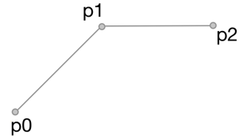

Here's what it looks like:

This uses cubic splines (aka bezier curves) to smooth out the lines
between points. To draw a bezier curve between two points, you must also
specify two control points which specify how it bends:

The problem is to determine those control points.

When you connect a bunch of bezier curves, each original point in the
series has both a left control point and a right control point. To avoid
forming a kink in the chart, the left control point, the series point
and the right control point all need to fall on a line.

The algorithm I wound up using follows the HighCharts implementation of
this. Here's how it works...

The setup is that you have a point whose left & right controls you're
trying to determine. You also know the previous and next point:

Start by placing the control points α of the way along each line
segment. This is the only parameter we'll need to control the amount of
smoothing:

But now we've broken the rule that the original point has to be on the
line between the control points! To fix that, we shift the control
points up by ∆y, which can be determined with some simple algebra:

But this introduces a new problem: the right control point is above the
data points, and so it will create an impression of a false maximum to
the right of the data point. To fix this, we cap the y-value of the
control points:

But now we've re-broken that rule about being on a line. So we have to
do the mirror-image adjustment to the left control point:

and now we have our control points!

Hopefully the algorithm makes good sense now. I implemented this as a
separate plotter in `/extras` for now, but it might make more sense to
move this into core dygraphs. That would make it easier to have the
smooth plots play nicely with other options like
`connectSeparatedPoints`, `strokePattern` and `drawPoints`.
